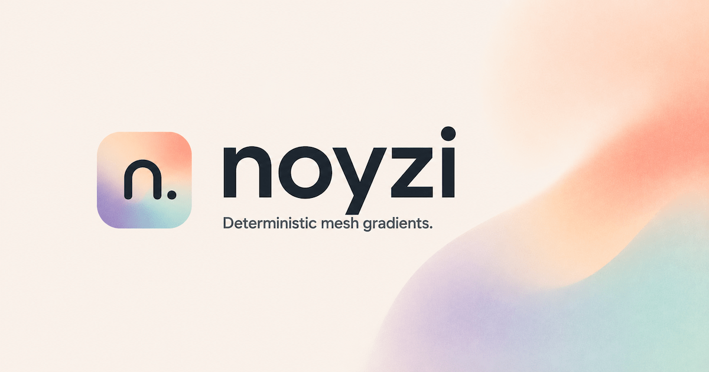

  

<h1 align="center">Noyzi</h1>

  Beautiful, deterministic mesh gradients from any string or number. Same seed, same artwork—forever.

  <a href="https://noyzi.dev">Website</a> ·
  <a href="https://noyzi.dev/docs">Docs</a> ·
  <a href="https://noyzi.dev/examples">Examples</a> ·
  <a href="https://github.com/breeg554/noyzi">GitHub</a>

## The idea

Noyzi turns emails, usernames, IDs, or any other stable value into a unique mesh gradient. The same seed always produces the same artwork—on the server and in the browser—so gradients can become visual identities without storing image assets.

## Packages

- [`@noyzi/core`](./packages/core) — framework-independent generator with CSS, SVG, canvas, WebP, and PNG output
- [`@noyzi/react`](./packages/react) — SSR-safe `<NoyziGradient />` component with zero client JavaScript

Use Noyzi for avatars, placeholders, covers, app icons, branded surfaces, and full-page backgrounds. Browse the [examples](https://noyzi.dev/examples) or read the [documentation](https://noyzi.dev/docs).

## License

[MIT](https://opensource.org/license/mit) © Noyzi
