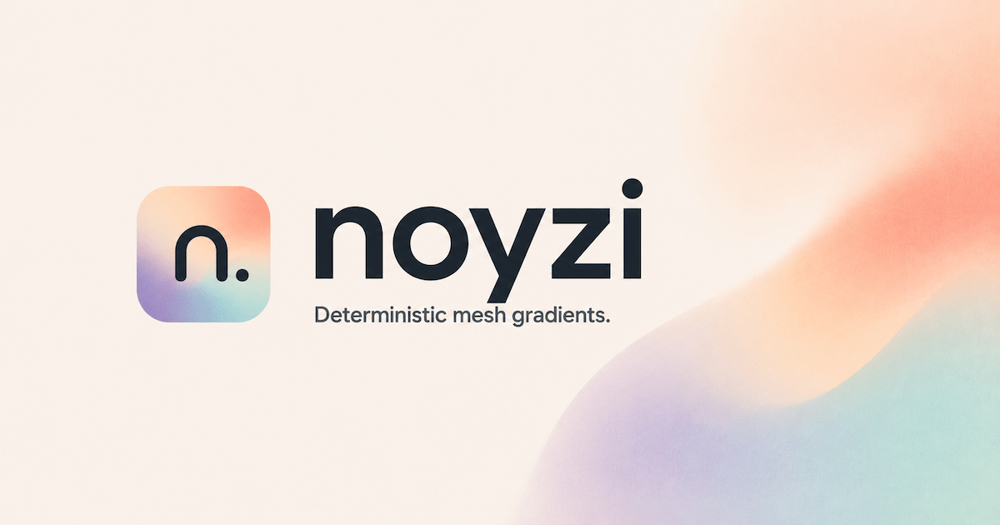

  

<h1 align="center">Noyzi</h1>

  Beautiful, deterministic structured gradients from any string or number. Same seed, same artwork—forever.

  <a href="https://noyzi.dev">Website</a> ·
  <a href="https://noyzi.dev/docs">Docs</a> ·
  <a href="https://noyzi.dev/examples">Examples</a> ·
  <a href="https://github.com/breeg554/noyzi">GitHub</a>

## Packages

- [`@noyzi/core`](./packages/core) — framework-independent generator with CSS, SVG, canvas, WebP, and PNG output
- [`@noyzi/react`](./packages/react) — SSR-safe `<NoyziGradient />` component with zero client JavaScript
- [shadcn components](https://noyzi.dev/docs#shadcn) — `npx shadcn@latest add https://noyzi.dev/r/noyzi-avatar.json`

Use Noyzi for avatars, placeholders, covers, app icons, branded surfaces, and full-page backgrounds. Browse the [examples](https://noyzi.dev/examples) or read the [documentation](https://noyzi.dev/docs).

## MCP

Gradient backgrounds, covers, and avatars for AI assistants. Connect your MCP client to `https://noyzi.dev/mcp`. See the [MCP docs](https://noyzi.dev/docs#mcp) for the tool and an example.

## License

[MIT](https://opensource.org/license/mit) © Noyzi
